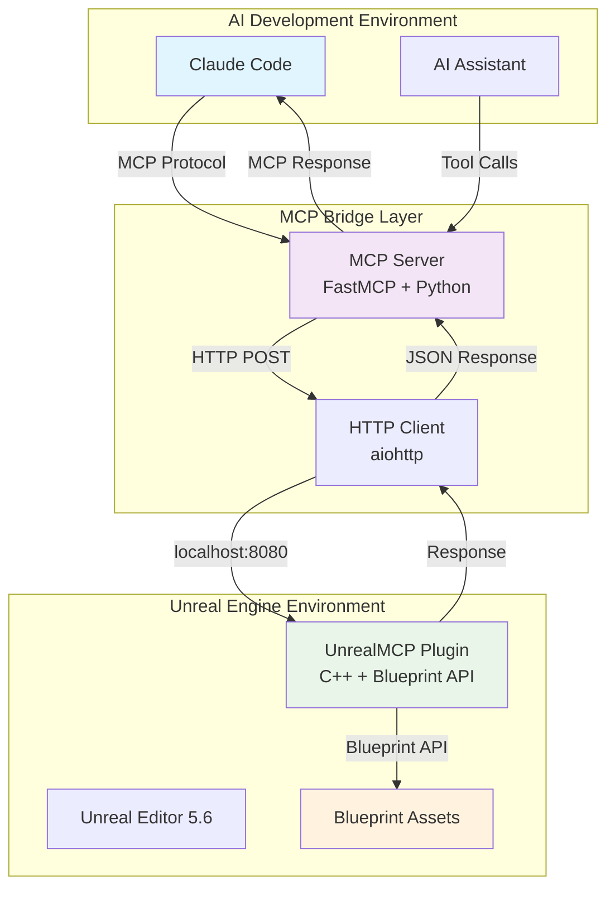
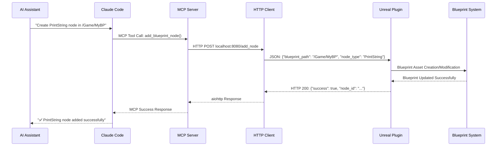

# Unreal MCP Bridge

🎮 **AI-Powered Unreal Engine Development Bridge** - Claude Code와 언리얼 엔진을 연결하는 MCP 기반 개발 도구

## 📋 프로젝트 개요

Unreal MCP Bridge는 AI 개발 도구(Claude Code)와 언리얼 엔진 5.6 사이의 원활한 통신을 가능하게 하는 **Model Context Protocol (MCP)** 기반 브릿지 시스템입니다. 이 프로젝트를 통해 AI가 직접 언리얼 에디터에서 블루프린트 노드를 생성하고 조작할 수 있습니다.

### 🎯 핵심 기능

- **🤖 AI-Native Blueprint Creation**: AI가 직접 블루프린트 노드를 생성
- **🔗 Real-time Communication**: Claude Code ↔ MCP Server ↔ Unreal Plugin 실시간 통신
- **🛡️ Type-Safe Integration**: FastMCP 기반의 안전한 타입 체크
- **⚡ Simple is Best**: 최소한의 복잡성으로 최대한의 효과 달성

## 🏗️ 시스템 아키텍처



## 🔄 데이터 플로우 시퀀스



## 🗂️ 폴더 구조

```
unreal_mcp\
├── 📁 .kb\                                    # AI 협업 지식베이스
│   ├── 📁 sessions\                           # 세션별 작업 기록
│   └── 📁 environment-paths.md                # 개발 환경 경로 설정
├── 📁 mcp_server\                             # MCP 서버 (Python)
│   └── 📄 main.py                             # FastMCP 기반 서버 구현
├── 📁 mcp_server_env\                         # Python 가상환경
│   ├── 📁 Scripts\
│   │   └── 🐍 python.exe                     # 격리된 Python 실행환경
│   └── 📁 Lib\site-packages\                 # FastMCP, aiohttp 등 패키지
├── 📁 unreal_plugin\                          # 언리얼 플러그인 소스
│   └── 📁 UnrealMCP\                          # 플러그인 루트
│       ├── 📄 UnrealMCP.uplugin               # 플러그인 메타데이터
│       └── 📁 Source\UnrealMCP\               # C++ 소스 코드
│           ├── 📁 Public\                     # 헤더 파일
│           │   ├── 📄 IUnrealMCP.h            # 모듈 인터페이스
│           │   ├── 📄 MCPBlueprintLibrary.h   # Blueprint 함수 라이브러리
│           │   ├── 📄 UnrealMCPSettings.h     # 플러그인 설정
│           │   └── 📄 UnrealMCPEditorSubsystem.h # 에디터 서브시스템
│           └── 📁 Private\                    # 구현 파일
│               ├── 📄 UnrealMCP.cpp           # 모듈 구현
│               ├── 📄 MCPBlueprintLibrary.cpp # Blueprint 함수 구현
│               ├── 📄 MCPHttpServer.cpp       # HTTP 서버 구현
│               └── 📄 UnrealMCPEditorSubsystem.cpp # 서브시스템 구현
├── 📄 .mcp.json                               # Claude Code MCP 설정
├── 📄 CLAUDE.md                               # Claude Code 협업 프로토콜
├── 📄 COLLABORATION-RULES.md                  # AI 간 협업 규칙
└── 📄 README.md                               # 이 파일
```

## 📦 설치 가이드

### 1️⃣ 사전 요구사항

- **Unreal Engine 5.6** (설치 경로: `Program Files\Epic Games\UE_5.6`)
- **Visual Studio 2022 Enterprise** (C++ 개발 환경)
- **Python 3.10+** (MCP 서버용)
- **Claude Code** (AI 개발 도구)

### 2️⃣ Python 가상환경 설정

```bash
# 프로젝트 디렉토리로 이동
cd unreal_mcp

# 가상환경 생성 (이미 존재함)
python -m venv mcp_server_env

# 가상환경 활성화
mcp_server_env\Scripts\activate

# 의존성 설치
pip install fastmcp>=0.5.0 aiohttp>=3.8.0
```

### 3️⃣ 언리얼 플러그인 설치

```bash
# 플러그인 폴더를 언리얼 프로젝트에 복사
# 소스: unreal_mcp\unreal_plugin\UnrealMCP
# 대상: [언리얼 프로젝트]\Plugins\UnrealMCP

# 예시 (PowerShell):
Copy-Item -Path "unreal_mcp\unreal_plugin\UnrealMCP" -Destination "[YourUnrealProject]\Plugins\" -Recurse

# 예시 (Command Prompt):
robocopy "unreal_mcp\unreal_plugin\UnrealMCP" "[YourUnrealProject]\Plugins\UnrealMCP" /E
```

### 4️⃣ 언리얼 플러그인 빌드

```bash
# 프로젝트 빌드 (Live Coding 비활성화 필요)
"D:\Program Files\Epic Games\UE_5.6\Engine\Build\BatchFiles\Build.bat" [YourProject]Editor Win64 Development -Project="[YourUnrealProject]\[YourProject].uproject" -WaitMutex
```

### 5️⃣ MCP 클라이언트 설정

#### 🔧 Claude Code 설정

`.mcp.json` 파일이 올바르게 설정되어 있는지 확인:

```json
{
  "mcpServers": {
    "unreal_mcp": {
      "command": "mcp_server_env\\Scripts\\python.exe",
      "args": ["mcp_server\\main.py"],
      "env": {}
    }
  }
}
```

#### 🖥️ Claude Desktop 설정

Claude Desktop에서도 이 MCP 서버를 사용할 수 있습니다:

**설정 파일 위치:**
- **Windows**: `%APPDATA%\Claude\claude_desktop_config.json`
- **macOS**: `~/Library/Application Support/Claude/claude_desktop_config.json`

**claude_desktop_config.json 설정:**

```json
{
  "mcpServers": {
    "unreal_mcp": {
      "command": "D:\\_Source\\unreal_mcp\\mcp_server_env\\Scripts\\python.exe",
      "args": ["D:\\_Source\\unreal_mcp\\mcp_server\\main.py"],
      "cwd": "D:\\_Source\\unreal_mcp"
    }
  }
}
```

**주의사항:**
- Claude Desktop에서는 **절대 경로**를 사용해야 합니다
- `cwd` (작업 디렉토리)를 명시적으로 설정하는 것을 권장합니다
- 설정 후 Claude Desktop을 재시작해야 MCP 서버가 로드됩니다

#### 🤖 Gemini CLI 설정

Gemini CLI에서도 이 MCP 서버를 사용할 수 있습니다:

**설정 파일**: `settings.json`

**Gemini CLI settings.json 설정:**

```json
{
  "mcpServers": {
    "unreal_mcp": {
      "command": "D:\\_Source\\unreal_mcp\\mcp_server_env\\Scripts\\python.exe",
      "args": ["D:\\_Source\\unreal_mcp\\mcp_server\\main.py"],
      "timeout": 15000,
      "trust": false
    }
  }
}
```

**Gemini CLI 사용법:**

```bash
# MCP 도구 사용 예시
gemini "Create a PrintString node in /Game/TestBP using the unreal_mcp tool"

# 또는 -y 플래그로 자동 승인
gemini -y "Add a blueprint node to my Unreal project"
```

**Gemini CLI 설정 옵션:**
- `timeout`: 요청 타임아웃 (밀리초)
- `trust`: true로 설정하면 도구 호출 확인을 건너뜀
- `includeTools`: 특정 도구만 허용 (선택사항)
- `excludeTools`: 특정 도구 제외 (선택사항)

## 🚀 사용 방법

### 0️⃣ MCP 서버 직접 실행 (선택사항)

MCP 서버는 AI 도구에서 자동으로 실행되지만, 디버깅이나 테스트를 위해 직접 실행할 수도 있습니다:

```bash
# 가상환경 활성화
mcp_server_env\Scripts\activate

# MCP 서버 직접 실행
python mcp_server/main.py

# 또는 절대 경로로 실행
D:\_Source\unreal_mcp\mcp_server_env\Scripts\python.exe D:\_Source\unreal_mcp\mcp_server\main.py
```

**MCP 서버 상태 확인:**
```bash
# 서버가 올바르게 시작되었는지 확인
curl http://localhost:8080/status

# 또는 PowerShell에서
Invoke-RestMethod -Uri "http://localhost:8080/status"
```

### 1️⃣ 언리얼 에디터 실행

```bash
# 언리얼 에디터 실행 (플러그인 자동 로드)
"D:\Program Files\Epic Games\UE_5.6\Engine\Binaries\Win64\UnrealEditor.exe" "[YourUnrealProject]\[YourProject].uproject"
```

### 2️⃣ Claude Code에서 AI와 상호작용

Claude Code에서 다음과 같이 AI에게 요청:

```
AI: "Create a PrintString node in the blueprint located at /Game/TestBP"
```

AI가 자동으로 MCP 도구를 호출하여 언리얼 에디터에 블루프린트 노드를 생성합니다.

### 3️⃣ 지원되는 AI 명령어

- **블루프린트 노드 생성**: `"Add a [NodeType] node to [BlueprintPath]"`
- **연결 테스트**: `"Test the MCP connection to Unreal Engine"`
- **서버 상태 확인**: `"Check if the Unreal MCP server is running"`

## 🔧 각 컴포넌트의 역할

### 🤖 AI Tools (AI 도구들)

#### 🔧 Claude Code
- **역할**: AI 어시스턴트와 사용자 간 개발 환경 통합 인터페이스
- **기능**: MCP 프로토콜을 통한 도구 호출 관리, 코드 편집 통합
- **통신**: JSON-RPC 기반 MCP 프로토콜
- **특징**: 개발 환경에 특화된 워크플로우

#### 🖥️ Claude Desktop
- **역할**: 데스크톱 AI 어시스턴트 애플리케이션
- **기능**: MCP 서버와의 직접 통합, 일반 사용자 친화적 인터페이스
- **통신**: MCP 프로토콜 (절대 경로 기반)
- **특징**: 스탠드얼론 데스크톱 앱, 재시작 후 MCP 로드

#### 🤖 Gemini CLI
- **역할**: 명령줄 기반 AI 어시스턴트 도구
- **기능**: 터미널에서 직접 MCP 도구 호출, 스크립트 통합 가능
- **통신**: MCP 프로토콜 (settings.json 기반)
- **특징**: 자동 승인 모드(-y), 도구 필터링 지원

### 🐍 MCP Server (Python + FastMCP)
- **역할**: AI 도구 호출을 HTTP 요청으로 변환하는 브릿지
- **기능**:
  - `add_blueprint_node()` 도구 제공
  - aiohttp를 통한 비동기 HTTP 클라이언트
  - 에러 처리 및 타임아웃 관리
- **통신**:
  - 입력: MCP 프로토콜 (STDIO)
  - 출력: HTTP POST → `localhost:8080`

### 🎮 Unreal Plugin (C++ + HTTP Server)
- **역할**: 언리얼 엔진 내에서 실제 블루프린트 조작 수행
- **핵심 컴포넌트**:
  - **MCPHttpServer**: HTTP 서버 (`localhost:8080`)
  - **MCPBlueprintLibrary**: Blueprint API 래퍼
  - **UnrealMCPEditorSubsystem**: 에디터 통합 관리
- **기능**:
  - `/add_node` 엔드포인트를 통한 블루프린트 노드 생성
  - UE5.6 Blueprint API를 통한 실제 에셋 조작
  - 실시간 서버 상태 모니터링

## 🔍 기술 스택

| 계층 | 기술 | 버전 | 역할 |
|------|------|------|------|
| **AI Interface** | Claude Code | Latest | AI 개발 도구 |
| **Protocol** | MCP (Model Context Protocol) | 1.0 | AI-Tool 통신 프로토콜 |
| **MCP Framework** | FastMCP | Latest | Python MCP 서버 프레임워크 |
| **HTTP Client** | aiohttp | 3.8+ | 비동기 HTTP 통신 |
| **Game Engine** | Unreal Engine | 5.6 | 게임 개발 플랫폼 |
| **Plugin Language** | C++ | 17 | 언리얼 플러그인 개발 |
| **HTTP Server** | UE5 HTTP Module | Built-in | 언리얼 내장 HTTP 서버 |

## 🌐 HTTP API 엔드포인트

언리얼 플러그인의 HTTP 서버는 `localhost:8080`에서 다음과 같은 REST API 엔드포인트를 제공합니다:

### 📋 엔드포인트 목록

#### 🔧 POST /add_node
블루프린트에 새로운 노드를 생성합니다.

**요청 형식:**
```http
POST http://localhost:8080/add_node
Content-Type: application/json

{
  "blueprint_path": "/Game/MyBlueprint",
  "node_type": "PrintString"
}
```

**응답 형식:**
```json
{
  "success": true,
  "message": "Blueprint created with PrintString node at '/Game/MyBlueprint'",
  "blueprint_path": "/Game/MyBlueprint",
  "node_type": "PrintString"
}
```

**매개변수:**
- `blueprint_path` (string): 생성할 블루프린트의 경로 (예: "/Game/TestBP")
- `node_type` (string): 생성할 노드 타입 (현재 "PrintString"만 지원)

**응답 코드:**
- `200 OK`: 성공적으로 처리됨
- `400 Bad Request`: 잘못된 JSON 형식 또는 매개변수

#### 📊 GET /status
서버 상태를 확인합니다.

**요청 형식:**
```http
GET http://localhost:8080/status
```

**응답 형식:**
```json
{
  "server_running": true,
  "port": 8080,
  "status": "UnrealMCP server is running",
  "version": "1.0"
}
```

**응답 코드:**
- `200 OK`: 서버가 정상 작동 중

### 🧪 API 테스트 예시

#### cURL을 사용한 테스트:

```bash
# 서버 상태 확인
curl http://localhost:8080/status

# 블루프린트 노드 생성
curl -X POST http://localhost:8080/add_node \
  -H "Content-Type: application/json" \
  -d '{"blueprint_path": "/Game/TestBP", "node_type": "PrintString"}'
```

#### PowerShell을 사용한 테스트:

```powershell
# 서버 상태 확인
Invoke-RestMethod -Uri "http://localhost:8080/status"

# 블루프린트 노드 생성
$body = @{
    blueprint_path = "/Game/TestBP"
    node_type = "PrintString"
} | ConvertTo-Json

Invoke-RestMethod -Uri "http://localhost:8080/add_node" -Method POST -Body $body -ContentType "application/json"
```

### ⚠️ 현재 제한사항

- **지원 노드 타입**: 현재 `PrintString`만 지원
- **에디터 전용**: Blueprint 생성은 에디터 빌드에서만 작동
- **포트 고정**: 현재 8080 포트로 고정 (향후 설정 가능하도록 확장 예정)

## 🎯 개발 철학: "Simple is Best"

이 프로젝트는 **"Simple is Best"** 원칙을 철저히 준수합니다:

### ✅ 구현된 단순성 원칙

1. **최소 기능 구현**: PrintString 노드 생성만 지원 (확장 가능한 구조)
2. **표준 패턴 사용**: UE5 공식 개발 패턴 준수
3. **명확한 인터페이스**: 각 계층 간 단순하고 명확한 API
4. **단일 책임**: 각 컴포넌트가 하나의 명확한 역할만 수행

### 📊 복잡성 메트릭

- **MCP Server**: 84줄의 Python 코드로 완전한 기능 구현
- **HTTP Server**: 125줄 함수로 블루프린트 생성 (정당한 복잡성)
- **Blueprint Library**: 3개 함수로 모든 필요 기능 제공
- **전체 평가**: 9.5/10 (거의 완벽한 Simple is Best 구현)

## 🛠️ 개발 및 디버깅

### 로그 확인

```bash
# 언리얼 에디터 로그와 함께 실행
"D:\Program Files\Epic Games\UE_5.6\Engine\Binaries\Win64\UnrealEditor.exe" "[YourUnrealProject]\[YourProject].uproject" -log
```

### 연결 테스트

Claude Code에서:
```
"Test MCP connection to check if everything is working"
```

### 일반적인 문제 해결

1. **연결 실패**: 언리얼 에디터가 실행 중인지 확인
2. **포트 충돌**: 8080 포트가 사용 가능한지 확인
3. **플러그인 로드 실패**: 프로젝트 빌드 후 에디터 재시작

## 🚀 확장 가능성

현재 구현은 **확장 가능한 아키텍처**를 제공합니다:

- **새로운 노드 타입**: `MCPHttpServer::CreateBlueprintWithPrintString()` 함수 확장
- **추가 엔드포인트**: HTTP 서버에 새로운 REST API 추가
- **복잡한 블루프린트 로직**: 노드 연결, 변수 설정 등 고급 기능
- **다른 언리얼 시스템**: 레벨 에디터, 머티리얼 에디터 등 통합

## 📄 라이선스

이 프로젝트는 개발 및 학습 목적으로 제작되었습니다.

---

**🎮 Made with ❤️ for AI-Powered Game Development**

*"Simple is best" - 복잡함 속에서 단순함을 찾아가는 여정*